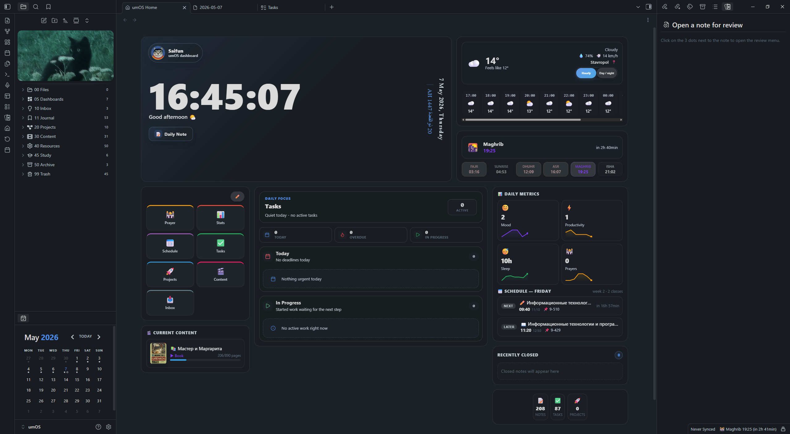
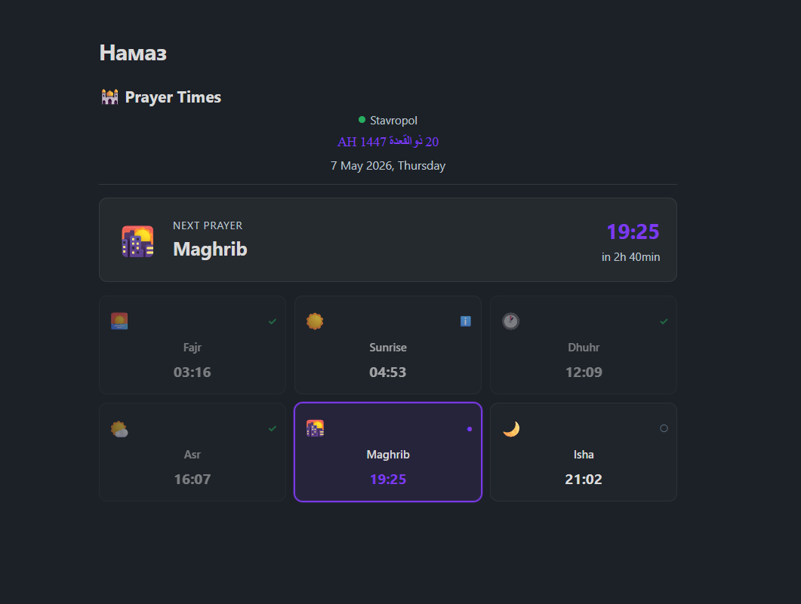
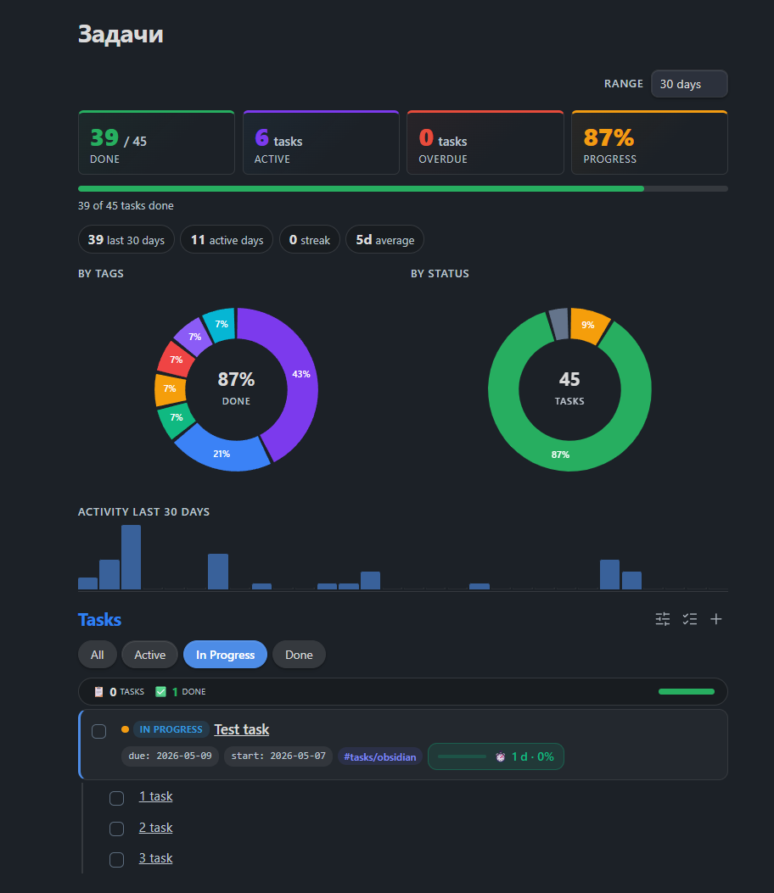
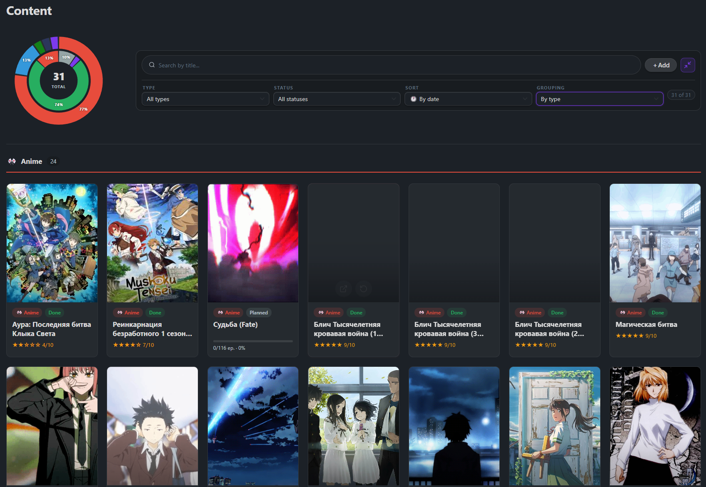
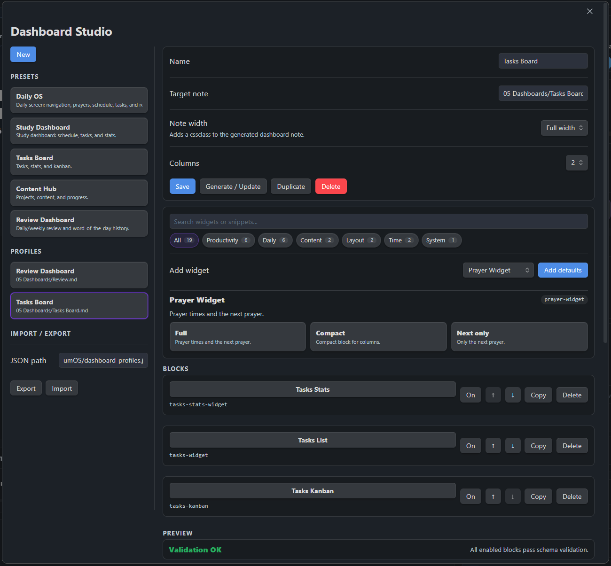
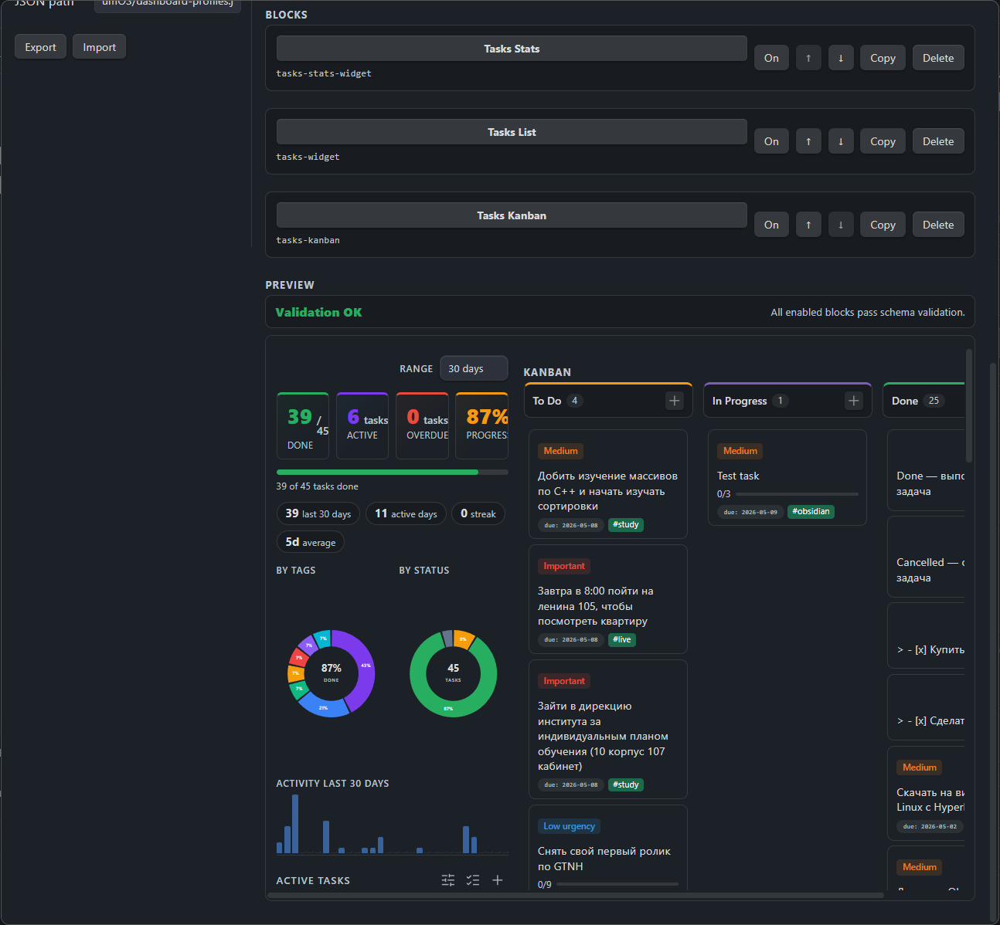
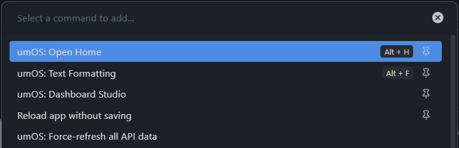

# umOS — Obsidian Life Management Plugin

> Disclaimer: this plugin and README were created with AI assistance.

> Version: `0.7.0-beta`

> Note: the plugin UI supports English and Russian from plugin settings.



**umOS** turns an Obsidian vault into a personal dashboard with prayer times, daily notes, schedule, tasks, stats, content tracking, and a custom home view.

## Screenshots

| | |
|---|---|
|  |  |
| **Home Dashboard** — live overview with weather, prayer, tasks, stats, schedule, and quick navigation | **Prayer Times** — Aladhan-powered prayer cards with next-prayer countdown |
|  |  |
| **Tasks Dashboard** — task stats, donut charts, activity, filters, and inline task management | **Content Gallery** — media library with progress, ratings, grouped cards, and filters |
|  |  |
| **Dashboard Studio** — presets, widget snippets, profile editor, and import/export | **Dashboard Preview** — generated dashboard validation and live widget preview |
|  | |
| **Commands** — Home, formatting, Dashboard Studio, and API refresh commands | |

## Features

| Area | What it does |
|---|---|
| **Home Dashboard** | Customizable home screen with navigation cards and live sections |
| **Daily Notes** | Auto-generated daily notes with configurable sections and inline navigation |
| **Prayer Times** | Prayer schedule via Aladhan API and status bar countdown |
| **Schedule** | Current class and weekly timetable with live countdowns |
| **Tasks** | Task list, kanban board, deadlines, and stats widgets |
| **Stats** | Mood, sleep, productivity, prayer metrics, and custom charts |
| **Content Gallery** | Grid/list gallery for anime, books, movies, and other media |
| **Project Gallery** | Gallery view for personal projects |
| **Weather** | Current weather on the home screen via Open-Meteo |
| **Formatting Tools** | `umos-input`, `cols-umos`, `info-umos`, countdown widgets, format picker |

## Installation

1. Download or clone this repository into:

```text
<vault>/.obsidian/plugins/umos-plugin/
```

2. Enable **umOS** in Obsidian → Settings → Community Plugins.
3. Open plugin settings and click **Create Structure** to scaffold default folders and dashboards.

> Warning: scaffolding moves existing root-level content into `temp/`.

## Quick Start

Open the Command Palette and run:

```text
umOS: Open Home
```

For dashboard work, run:

```text
umOS: Dashboard Studio
```

Dashboard Studio lets you create profiles from presets, search widgets/snippets, preview the generated markdown, and write/update the target note.

## Dashboard Profiles

Dashboard profiles are stored in plugin data and can be exported to vault JSON. The default path is:

```text
umOS/dashboard-profiles.json
```

Each profile contains:

| Field | Meaning |
|---|---|
| `id` | Stable profile id |
| `name` | Name shown in Dashboard Studio |
| `targetPath` | Markdown note generated/updated by the profile |
| `columns` | Dashboard column count |
| `widthMode` | `default`, `soft`, or `wide` note width |
| `blocks` | Ordered widget blocks with `widget`, `config`, `enabled`, and `column` |
| `updatedAt` | Merge timestamp used by import |

Import opens a preview report before applying changes. Newer profiles with the same `id` update existing profiles, older duplicates are skipped, invalid profiles are reported, and a backup JSON is written before merge.

## Dashboard Studio Snippets

Widgets expose quick snippets inside Dashboard Studio. Use search to find widgets by block name, title, description, category, or snippet text.

Useful presets:

| Preset | Purpose |
|---|---|
| `Daily OS` | Daily navigation, prayer, schedule, tasks, review |
| `Study Dashboard` | Schedule, study tasks, stats |
| `Tasks Board` | Task list, stats, kanban |
| `Content Hub` | Content and project galleries |
| `Review Dashboard` | Daily/weekly review and word history |

## Widgets

Widgets are rendered from fenced code blocks inside any note.

### Core

| Block | Options |
|---|---|
| `prayer-widget` | `show: times\|next\|both`, `style: full\|compact`, `show_sunrise: true\|false` |
| `schedule` | `show: current\|week\|both`, `highlight: true\|false`, `countdown: true\|false` |
| `tasks-widget` | task filters and creation options |
| `tasks-stats-widget` | task filters |
| `tasks-kanban` | task filters and creation options |
| `umos-stats` | `metrics`, `period`, `chart`, `compare` |
| `words-of-day` | `period`, `field` |
| `daily-nav` | — |
| `word-of-day` | `property`, `placeholder` |

### Layout & Content

| Block | Options |
|---|---|
| `content-gallery` | `style: grid\|list` |
| `project-gallery` | `style: grid\|list` |
| `countdown` | `date` or `target`, `title`, `accent`, `layout`, `nested`, `view`, `legend`, `show_legend` |
| `countdown-rings` | same as `countdown` |
| `kanban-board` | `id` |
| `cols-umos` | custom two-column content |
| `info-umos` | infobox-style layout |
| `umos-input` | interactive frontmatter widgets |

## Command Input

`umos-input` can run deterministic commands with `type: command`.

````text
```umos-input
type: command
placeholder: task Prepare notes tomorrow #study !high
target: current
help: true
history: true
```
````

Supported MVP syntax:

```text
task <text> [today|tomorrow|YYYY-MM-DD] [#tag] [!high|!medium|!low]
countdown <title> <YYYY-MM-DD|YYYY-MM-DD HH:MM>
schedule <subject> <monday..saturday> <HH:MM-HH:MM> [room:...] [type:lecture|seminar|lab|practice|exam] [week:current|week1|week2]
review <win|lesson|tomorrow|weekly_win|weekly_friction|weekly_next> <text>
```

No AI/NLP is required; commands are parsed by fixed syntax.

## CSS Classes

Add these to note frontmatter:

```yaml
cssclasses:
  - umos-wide
```

`umos-wide` makes the note full-width. `umos-wide-soft` expands the note only a bit beyond the normal line width. The soft width is configurable in plugin settings.

## Commands

| Command | Action |
|---|---|
| `umOS: Open Home` | Open the main dashboard |
| `umOS: Create Daily Note` | Create today's daily note |
| `umOS: Schedule Editor` | Open the schedule editor |
| `umOS: Dashboard Studio` | Create, preview, import/export, and generate dashboard profiles |
| `umOS: Next Prayer` | Show next prayer time |
| `umOS: Formatting Text` | Open the format picker |

Ribbon buttons: **Home**, **Calendar**.

## Settings

- **System** — profile, scaffold, demo note, daily note, home, stats, sync
- **Islam** — prayer and location
- **Study** — schedule
- **Other** — content

## Data Sources

| Service | Provider |
|---|---|
| Prayer times | [Aladhan API](https://aladhan.com/prayer-times-api) |
| Geolocation | [ip-api.com](http://ip-api.com) |
| Weather | [Open-Meteo](https://open-meteo.com) |

## Development

```bash
npm install
npm run dev
npm run build
npm run typecheck
```

Built with [esbuild](https://esbuild.github.io/). Output: `main.js` and `styles.css`.

## License

MIT
