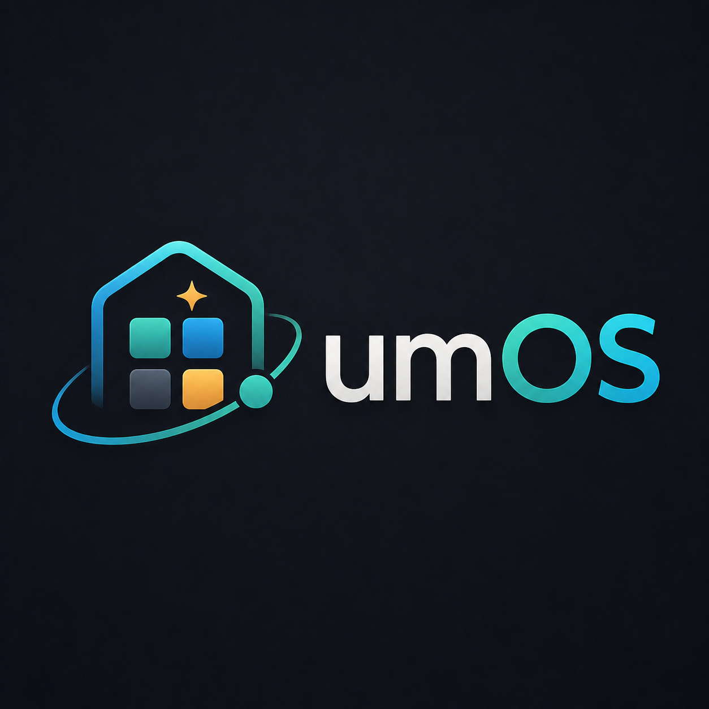

# umOS — Obsidian Life Management Plugin

<p align="center">
  
</p>

<p align="center">
  <strong>A personal operating system for Obsidian.</strong>
</p>

> Disclaimer: this plugin and README were created with AI assistance.
>
> Version: `0.8.5-beta`
>
> Note: the plugin UI supports English and Russian from plugin settings.


**umOS** turns an Obsidian vault into a personal dashboard with prayer times, daily notes, schedule, tasks, stats, content tracking, and a custom home view.

## Features

- **Home Dashboard**: Customizable home screen with navigation cards and live sections.
- **Daily Notes**: Auto-generated daily notes with configurable sections and inline navigation.
- **Prayer Times**: Prayer schedule via Aladhan API and status bar countdown.
- **Schedule**: Current class and weekly timetable with live countdowns.
- **Tasks**: Task list, completed-task history, kanban board, deadlines, and stats widgets.
- **Stats**: Mood, sleep, productivity, prayer metrics, and custom charts.
- **Content & Project Galleries**: Grid/list galleries for anime, books, movies, media, and personal projects.
- **Weather**: Current weather on the home screen via Open-Meteo.
- **Formatting Tools**: `umos-input`, `cols-umos`, `info-umos`, countdown widgets, and a format picker.

## Screenshots

### Home Dashboard
*Live overview with weather, prayer, tasks, stats, schedule, and quick navigation.*


### Prayer Times
*Aladhan-powered prayer cards with next-prayer countdown.*


### Tasks Dashboard
*Task stats, donut charts, activity, filters, and inline task management.*


### Content Gallery
*Media library with progress, ratings, grouped cards, and filters.*


### Dashboard Studio
*Presets, widget snippets, profile editor, and import/export.*


### Dashboard Preview
*Generated dashboard validation and live widget preview.*


### Command Palette
*Home, formatting, Dashboard Studio, and API refresh commands.*


## Installation

1. Download or clone this repository into your plugins folder:
   ```text
   <vault>/.obsidian/plugins/umos-plugin/
   ```
2. Enable **umOS** in Obsidian → Settings → Community Plugins.
3. Open plugin settings and click **Create Structure** to scaffold default folders and dashboards.
   > **Warning:** scaffolding moves existing root-level content into `temp/`.

## Quick Start

Open the Command Palette and run:

```text
umOS: Open Home
```

For dashboard work, run:

```text
umOS: Dashboard Studio
```

Dashboard Studio lets you create profiles from presets, search widgets/snippets, preview the generated markdown, and write/update the target note.

## Dashboard Profiles

Dashboard profiles are stored in plugin data and can be exported to vault JSON. The default path is:

```text
umOS/dashboard-profiles.json
```

Each profile contains a stable ID, name, target path for the generated markdown note, column count, width mode, and ordered widget blocks. Import opens a preview report before applying changes. Newer profiles update existing ones, duplicates are skipped, and a backup JSON is written before any merge.

## Widgets

Widgets are rendered from fenced code blocks inside any note. You can find quick snippets in the **Dashboard Studio**.

### Core Widgets
- `prayer-widget`: Options for `show: times|next|both`, `style: full|compact`, `show_sunrise: true|false`.
- `schedule`: Options for `show: current|week|both`, `highlight: true|false`, `countdown: true|false`.
- `tasks-widget`: Task filters and creation options.
- `tasks-stats-widget`: Task filters.
- `tasks-completed-widget`: Completed tasks for today / 7 days / 30 days, collapsed by default.
- `tasks-kanban`: Task filters and creation options.
- `umos-stats`: Options for `metrics`, `period`, `chart`, `compare`.
- `words-of-day`: Options for `period`, `field`.
- `daily-nav`: Navigation for daily notes.
- `word-of-day`: Options for `property`, `placeholder`.

### Layout & Content
- `content-gallery` / `project-gallery`: Options for `style: grid|list`.
- `countdown` / `countdown-rings`: Options for `date` or `target`, `title`, `accent`, `layout`, etc.
- `kanban-board`: Define by `id`.
- `cols-umos`: Custom two-column content.
- `info-umos`: Infobox-style layout.
- `umos-input`: Interactive frontmatter widgets.

## Command Input

`umos-input` can run deterministic commands with `type: command`.

````text
```umos-input
type: command
placeholder: task Prepare notes tomorrow #study !high
target: current
help: true
history: true
```
````

### Supported MVP syntax:
- `task <text> [today|tomorrow|YYYY-MM-DD] [#tag] [!high|!medium|!low]`
- `countdown <title> <YYYY-MM-DD|YYYY-MM-DD HH:MM>`
- `schedule <subject> <monday..saturday> <HH:MM-HH:MM> [room:...] [type:lecture|seminar|lab|practice|exam] [week:current|week1|week2]`
- `review <win|lesson|tomorrow|weekly_win|weekly_friction|weekly_next> <text>`

*No AI/NLP is required; commands are parsed by fixed syntax.*

## CSS Classes

Add these to note frontmatter to adjust the width:

```yaml
cssclasses:
  - umos-wide
```

- `umos-wide`: Makes the note full-width.
- `umos-wide-soft`: Expands the note a bit beyond the normal line width (configurable in settings).

## Commands

- `umOS: Open Home`: Open the main dashboard
- `umOS: Create Daily Note`: Create today's daily note
- `umOS: Schedule Editor`: Open the schedule editor
- `umOS: Dashboard Studio`: Create, preview, import/export, and generate dashboard profiles
- `umOS: Next Prayer`: Show next prayer time
- `umOS: Formatting Text`: Open the format picker

Ribbon buttons: **Home**, **Calendar**.

## Settings & Data Sources

**Settings Sections:** System, Islam (prayer & location), Study (schedule), Other (content).

**Data Sources:**
- Prayer times: [Aladhan API](https://aladhan.com/prayer-times-api)
- Geolocation: [ip-api.com](http://ip-api.com)
- Weather: [Open-Meteo](https://open-meteo.com)

## Development

```bash
npm install
npm run dev
npm run build
npm run typecheck
```

Built with [esbuild](https://esbuild.github.io/). Output: `main.js` and `styles.css`.

## License

MIT
