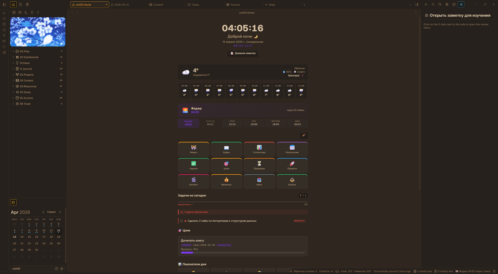

# umOS — Obsidian Life Management Plugin

> **Disclaimer:** This plugin, its codebase, and this README were entirely generated with the assistance of AI (Claude by Anthropic).



**umOS** is a comprehensive life-management system built as an Obsidian plugin. It turns your vault into a personal OS — a single place to track prayers, habits, tasks, finances, schedule, goals, exams, and more, all rendered as interactive markdown widgets directly inside your notes.

---

## Features

| Area | What it does |
|---|---|
| **Home Dashboard** | Customizable home screen with navigation cards and live section widgets |
| **Daily Notes** | Auto-generated daily notes with configurable sections and an inline navigator |
| **Prayer Times** | Prayer schedule via Aladhan API, status bar countdown, per-prayer notifications |
| **Quran** | Verse of the day, juz tracker with grid/progress views |
| **Ramadan** | Fast and tarawih tracker |
| **Habits** | Daily habit check-off grid + per-habit calendar heatmap |
| **Schedule** | Current class / weekly timetable with live countdown timers |
| **Tasks** | Task list, kanban board, deadline overview, and stats widget |
| **Pomodoro** | Focus timer with session counter and compact/full modes |
| **Exams** | Exam list with priority levels and topic breakdown |
| **Finance** | Income/expense transactions, categories, monthly budget overview |
| **Balance** | Personal balance tracker |
| **Goals** | Goals widget with a quick-add modal |
| **Content Gallery** | Grid/list gallery for anime, books, movies, and other media |
| **Project Gallery** | Same layout for personal projects |
| **Stats** | Mood, sleep, and custom metric charts (sparkline, bar, ring) |
| **Weather** | Current weather on the home screen via Open-Meteo |
| **Quick Capture** | Fast task/note modal and full URI scheme support |

---

## Installation

1. Download or clone this repository into your vault:
   ```
   <vault>/.obsidian/plugins/umos-plugin/
   ```
2. Enable **umOS** in Obsidian → Settings → Community Plugins.
3. Open plugin settings and click **Create Structure** to scaffold the default folders and dashboards.

> **Warning:** All existing files and folders will be moved to `temp/` during scaffolding.

---

## Quick Start

After enabling the plugin, open the Command Palette (`Ctrl+P`) and run:

```
umOS: Open Home
```

This opens the main dashboard. From there you can navigate to any module.

---

## Widgets

Widgets are rendered from fenced code blocks inside any note. Place the block name as the language identifier and set options in the body using YAML-style key: value pairs.

### Example

````md
```prayer-widget
show: both
style: full
show_sunrise: true
```
````

### All Widgets

#### Religion

| Block | Options |
|---|---|
| `prayer-widget` | `show: times\|next\|both`, `style: full\|compact`, `show_sunrise: true\|false` |
| `ayat-daily` | `count: number`, `language: ru.kuliev`, `show_arabic: true\|false` |
| `quran-tracker` | `style: grid\|progress\|both` |
| `ramadan-widget` | `style: full\|compact` |

#### Productivity

| Block | Options |
|---|---|
| `schedule` | `show: current\|week\|both`, `highlight: true\|false`, `countdown: true\|false` |
| `habits` | `date: today\|YYYY-MM-DD`, `style: grid\|list` |
| `habit-calendar` | `habit: <name>`, `months: number` |
| `tasks-widget` | — |
| `tasks-stats-widget` | — |
| `tasks-kanban` | — |
| `pomodoro` | `style: full\|compact` |
| `exam-tracker` | `show: upcoming\|all`, `style: full\|compact` |
| `umos-goals` | — |

#### Finance & Stats

| Block | Options |
|---|---|
| `finance-tracker` | `month: YYYY-MM`, `style: full\|compact` |
| `balance-tracker` | — |
| `umos-stats` | `metrics: ["mood","sleep",...]`, `period: number`, `chart: sparkline\|bar\|ring\|none`, `compare: true\|false` |

#### Navigation & Layout

| Block | Options |
|---|---|
| `daily-nav` | — |
| `content-gallery` | `style: grid\|list` |
| `project-gallery` | `style: grid\|list` |

---

## Commands

Available via the Command Palette (`Ctrl+P`):

| Command | Action |
|---|---|
| `umOS: Open Home` | Open the main dashboard |
| `umOS: Quick Task` | Open quick task capture modal |
| `umOS: Quick Note` | Open quick note capture modal |
| `umOS: Add Goal` | Open goal creation modal |
| `umOS: Create Daily Note` | Create today's daily note |
| `umOS: Schedule Editor` | Open the schedule editor |
| `umOS: Next Prayer` | Show next prayer time in a notice |
| `umOS: Pomodoro: Start/Pause` | Toggle the pomodoro timer |
| `umOS: Mark Habit` | Quick habit check-off |

Ribbon buttons: **Home**, **Calendar** (daily note), **Plus** (quick task).

---

## URI Capture

umOS supports the `obsidian://` URI scheme for external capture (e.g. from a phone shortcut or browser bookmark):

```
obsidian://umos/capture?type=task&text=Buy%20milk&priority=high
```

| Parameter | Values |
|---|---|
| `type` | `task` \| `note` |
| `text` | URL-encoded text content |
| `priority` | `high` \| `medium` \| `low` \| `none` (tasks only) |

If `text` is omitted, the quick capture modal opens instead.

---

## Settings

All settings are available in the plugin settings tab and are persisted via Obsidian's `saveData`. Sections:

- **Vault Structure** — folder skeleton and dashboard scaffolding
- **Daily Note** — path, date format, enabled sections
- **Habits** — habit list and configuration
- **Quick Capture** — default folder and format
- **Location** — used for prayer times and weather
- **Prayer** — calculation method, school, adjustments
- **Quran** — translation language, display options
- **Ramadan** — fast tracking options
- **Pomodoro** — work/break durations, session goals
- **Exams** — exam list and topic settings
- **Schedule** — timetable data and display options
- **Content** — media categories and gallery layout
- **Home** — visible sections and card layout
- **Stats** — tracked metrics and chart types
- **Finance** — currency, categories, budget limits

---

## Data Sources

| Service | Provider |
|---|---|
| Prayer times | [Aladhan API](https://aladhan.com/prayer-times-api) |
| Quran text | [Al Quran Cloud API](https://alquran.cloud/api) |
| Geolocation | [ip-api.com](http://ip-api.com) |
| Weather | [Open-Meteo](https://open-meteo.com) |

---

## Development

```bash
npm install
npm run dev        # watch mode (esbuild)
npm run build      # production build → main.js
npm run typecheck  # TypeScript type check (no emit)
```

Built with [esbuild](https://esbuild.github.io/) via `esbuild.config.mjs`. Output: `main.js` + `styles.css`.

---

## License

MIT
